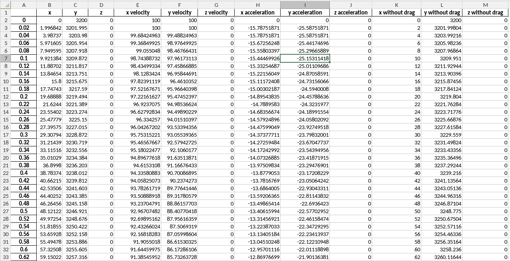

# Welcome to THE CRAZY VOLCANO EDITOR

In here, you will be able to model, learn and visualize different projectile launches, from the easiest simple rock, to a million rocks with different densities, and sizes.

### Learn:

You will be able to learn a lot of physics things, the interactable learn page will teach you part by part everything you need to learn to be able to use to model yourself the volcano launch! 

**The learn tab makes it fun too!**, you will be able to learn by doing, with interactable sliders, you will be able to interact with the graphs,learn about the real volcano Popocatepetl, and get creative with grand posibilities that the interactable graphs have to offer. But the fun not just ends there, extra material will be avaible if you want even more learning.

Not enough?

### Crazy volcano editor:

Make and change the variables of any volcano, check and see comparisons between different variables, run your own simulations, coppy another volcano variables, or just launch a crazy projectile that is not even possible in real life!

Here, you can change every single variable inside the code, without having to actually run the Code!

But I see, you want to store your launches for future use, well, we got you covered!

**Save all your variables, and graphs in excel*, or in our own costum saving format as JSON**

All excel saves will make sure you save all the information for you to do whatever you want with all the datasets!



If you wish to just save your image, and later graph it again, no problem, our JSON format ensures that all the information is stored, and anyone who knows how to do something with it, can play with it in code!


## Download & installing

To make sure you get the latest version, visit the [official repository realeases](https://github.com/MrDrHax/modelacionVolcanica/releases), and download the latest zip.

to make the setup easier, I included a `setup.py` script, this will make sure you have all the dependencies needed, and will install them for you if you don't have them.

To run the script, open a terminal and navigate to your folder.

Run `python3 setup.py`

Run the script a second time to ensure everything is installed properly!

if all went as it should, you will see:
```
python version meets minimum requirements
All software requirements are met, not runing any extra procceses.
```

This will mean you have installed:
- python 3.8+
- streamlit
- numpy
- matplotlib
- pandas
- mpl-toolkits

and no further requirements are needed.

if all works, run in the same terminal:
`streamlit run mainStreamlit.py`

and that's it!

if it kikes you out, go to localhost:8501 to rejoin!
